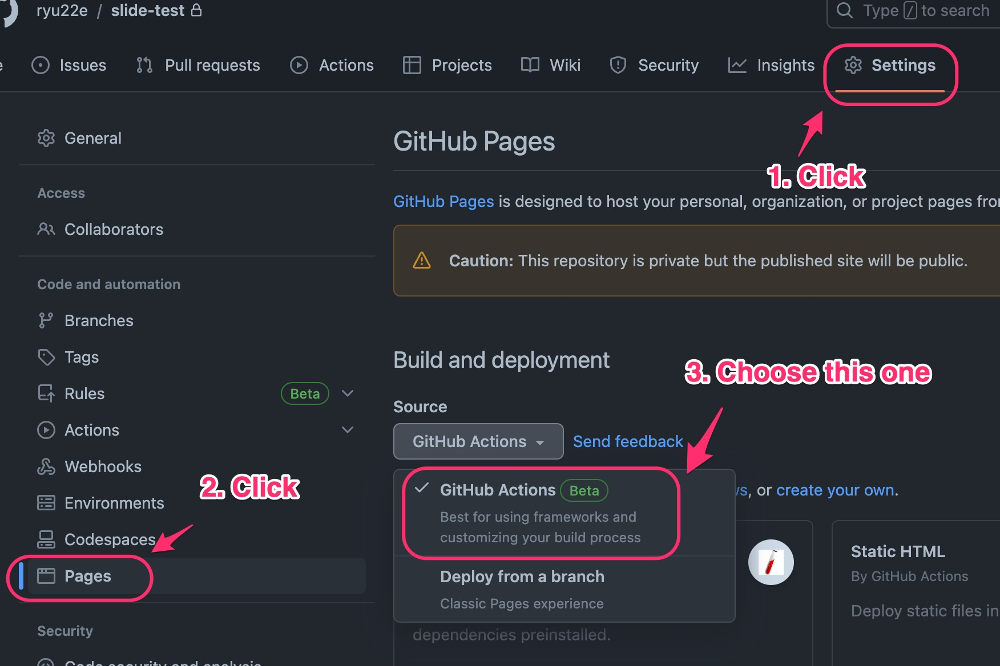

# cookiecutter-sphinx-revealjs

Cookiecutter Template for sphinx-revealjs.

You can easily create presentation slides to publish on GitHub Pages.

This is recommended for people who:

* Want to create slides using their preferred text editor
* Are familiar with reStructuredText or Markdown
* Have experience using Sphinx

## Usage

```shell
$ cookiecutter gh:ryu22e/cookiecutter-sphinx-revealjs
  [1/17] project_name (cookiecutter sphinx revealjs):
  [2/17] project_slug (cookiecutter-sphinx-revealjs):
  [3/17] title (Example):
  [4/17] Select python_version
    1 - 3.13
    2 - 3.12
    3 - 3.11
    4 - 3.10
    Choose from [1/2/3/4] (1):
  [5/17] site_url (https://example.com):
  [6/17] copyright_year (2026):
  [7/17] author_name (Ryuji Tsutsui):
  [8/17] release (1.0):
  [9/17] language (ja):
  [10/17] enable_budoux (y):
  [11/17] enable_robots_txt (y):
  [12/17] enable_favicon (y):
  [13/17] disable_title_uppercase (n):
  [14/17] enable_embed_video (n):
  [15/17] Select style
    1 - reStructuredText
    2 - Markdown
    Choose from [1/2] (1):
  [16/17] Select revealjs_style_theme
    1 - black
    2 - white
    3 - league
    4 - beige
    5 - sky
    6 - night
    7 - serif
    8 - simple
    9 - solarized
    10 - blood
    11 - moon
    Choose from [1/2/3/4/5/6/7/8/9/10/11] (1):
  [17/17] Select license
    1 - CC BY 4.0
    2 - None
    Choose from [1/2] (1):
$ cd cookiecutter-sphinx-revealjs
$ python3 -m venv .venv
$ source .venv/bin/activate
(.venv)$ pip install -r requirements.txt
(.venv)$ playwright install --with-deps chromium  # Run only once initially
(.venv)$ make revealjs
(.venv)$ ls build/revealjs
_sources    _static     favicon.ico index.html  objects.inv robots.txt
```

## Setting up GitHub Pages


